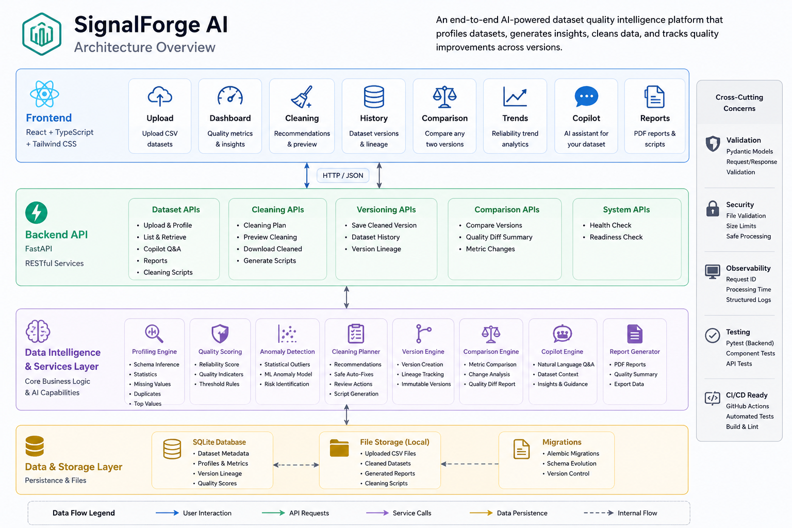
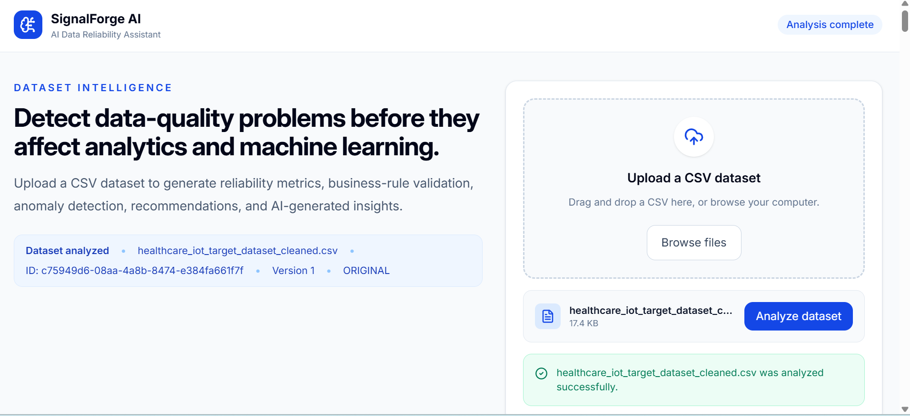
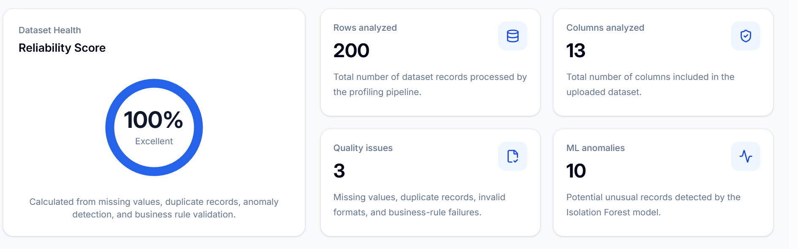
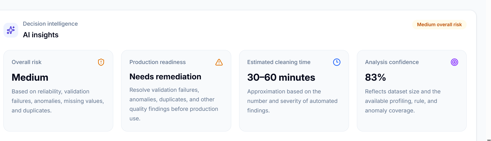
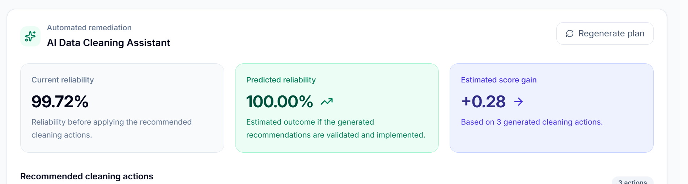

# 🚀 SignalForge AI

<p align="center">
  
</p>

<p align="center">
<b>AI-Powered Dataset Quality Intelligence Platform</b><br>
Analyze, profile, clean, version, compare, and monitor dataset quality using a production-ready FastAPI + React platform.
</p>

---

<p align="center">

[](https://www.python.org/)
[](https://fastapi.tiangolo.com/)
[](https://react.dev/)
[](https://www.typescriptlang.org/)
[](https://www.sqlite.org/)
[](https://www.sqlalchemy.org/)
[](https://github.com/Shekhar0419/signalforge-ai/actions)
[](LICENSE)

</p>

---

# 🌐 Live Demo

### Frontend

https://signalforge-ai-two.vercel.app

### Backend API

https://signalforge-api-iord.onrender.com

### Swagger Documentation

https://signalforge-api-iord.onrender.com/docs

---

# 📖 Overview

SignalForge AI is an end-to-end Dataset Quality Intelligence Platform that enables data engineers, analysts, and machine learning teams to evaluate dataset quality before datasets enter downstream analytics or AI pipelines.

The platform combines deterministic profiling, statistical analysis, anomaly detection, automated cleaning recommendations, dataset versioning, comparison analytics, PDF reporting, and an AI-powered data copilot into a single production-ready application.

Instead of relying on multiple disconnected tools, SignalForge AI provides one unified workflow for understanding, improving, and monitoring dataset quality.

---

# ✨ Key Capabilities

- Upload CSV datasets
- Automated dataset profiling
- Reliability score calculation
- Missing value detection
- Duplicate record detection
- Statistical outlier detection
- AI-generated quality insights
- Dataset cleaning recommendations
- Cleaning preview before execution
- Cleaned dataset download
- Dataset version management
- Dataset history tracking
- Version comparison analytics
- Reliability trend visualization
- AI Data Copilot
- PDF quality reports
- REST API
- Production deployment
- Automated CI/CD

---

# 🏗 Architecture

<p align="center">

</p>

SignalForge AI follows a modern production architecture consisting of:

- React + TypeScript frontend
- FastAPI REST backend
- SQLAlchemy ORM
- SQLite persistence layer
- Alembic database migrations
- GitHub Actions CI
- Render deployment
- Vercel deployment

---

# 🛠 Technology Stack

## Backend

| Technology | Purpose |
|------------|----------|
| Python 3.11 | Core language |
| FastAPI | REST API |
| SQLAlchemy | ORM |
| Alembic | Database migrations |
| SQLite | Database |
| Pandas | Data profiling |
| NumPy | Statistical computation |
| Scikit-Learn | Anomaly detection |
| ReportLab | PDF generation |
| Uvicorn | ASGI Server |

---

## Frontend

| Technology | Purpose |
|------------|----------|
| React 18 | UI |
| TypeScript | Static typing |
| Vite | Build tool |
| Axios | API communication |
| Recharts | Analytics visualization |
| CSS | Styling |

---

## DevOps

| Technology | Purpose |
|------------|----------|
| GitHub Actions | Continuous Integration |
| Docker | Containerization |
| Render | Backend Hosting |
| Vercel | Frontend Hosting |
| Git | Version Control |

---

# 📂 Project Structure

```text
signalforge-ai/

├── app/
│   ├── api/
│   ├── db/
│   ├── models/
│   ├── services/
│   └── main.py
│
├── frontend/
│   ├── src/
│   ├── components/
│   ├── services/
│   └── App.tsx
│
├── alembic/
├── docs/
├── tests/
├── data/
│
├── Dockerfile
├── alembic.ini
├── pyproject.toml
├── README.md
└── LICENSE
```

---

# 🚀 Core Features

SignalForge AI provides an end-to-end workflow for assessing, improving, and managing dataset quality.

The platform combines automated profiling, deterministic validation, statistical analysis, anomaly detection, cleaning intelligence, version management, and AI-powered insights into a single production-ready application.

# 📊 Dataset Profiling

SignalForge AI performs a comprehensive quality assessment immediately after a dataset is uploaded.

The profiling engine automatically extracts structural, statistical, and quality-related metadata that helps users understand the health of their datasets before they enter downstream analytics or machine-learning pipelines.

### Generated Metrics

- Total rows
- Total columns
- Dataset size
- Column data types
- Missing value count
- Missing value percentage
- Duplicate row count
- Duplicate ratio
- Unique value statistics
- Numeric summary statistics
- Minimum values
- Maximum values
- Mean
- Median
- Standard deviation
- Reliability score
- Outlier statistics
- Quality indicators

---

# 📈 Dataset Quality Intelligence

SignalForge AI combines deterministic validation with statistical analysis to identify common data-quality issues.

The quality engine evaluates every uploaded dataset and generates meaningful insights for engineers before any cleaning operations begin.

### Quality Checks

- Missing values
- Duplicate records
- Empty columns
- Constant-value columns
- Invalid numeric values
- Statistical outliers
- Suspicious distributions
- High-null columns
- Feature consistency
- Dataset completeness
- Reliability scoring

---

# 🤖 AI Dataset Insights

Instead of only reporting raw statistics, SignalForge AI explains the dataset in natural language.

The AI Insight Engine summarizes:

- Overall dataset health
- Critical quality issues
- Recommended cleaning strategy
- Dataset reliability
- Analytics readiness
- Machine-learning readiness

These insights help engineers prioritize quality improvements before model training or reporting.

---

# 🧹 Cleaning Assistant

SignalForge AI automatically recommends deterministic cleaning operations.

Rather than modifying the dataset immediately, the platform generates recommended actions and lets the user review them before execution.

### Supported Cleaning Operations

- Remove duplicate rows
- Fill missing values
- Drop empty columns
- Normalize text values
- Standardize formatting
- Remove invalid records
- Trim whitespace
- Handle outliers
- Convert data types

---

## Code Generation

SignalForge AI also generates example implementations for multiple technologies.

Supported outputs include:

- Pandas
- SQL
- PySpark

This allows engineers to integrate cleaning logic into existing data pipelines.

---

# 🔍 Cleaning Preview

Before saving a cleaned dataset, SignalForge AI generates a preview showing exactly what will change.

Users can review every transformation before committing a new version.

The preview includes:

- Before and after row counts
- Duplicate removal
- Missing value reduction
- Reliability score improvement
- Cleaning actions applied
- Review-required operations
- Sample cleaned rows

---

# 📂 Dataset Version Management

Every uploaded dataset becomes Version 1.

Instead of overwriting existing data, SignalForge AI stores each cleaned dataset as a new immutable version.

Benefits include:

- Full audit trail
- Historical comparisons
- Version lineage
- Safe experimentation
- Rollback capability

Example:

```text
Version 1
      │
      ▼
Version 2
      │
      ▼
Version 3
```

Each version preserves its own:

- Quality metrics
- Reliability score
- AI insights
- Cleaning history
- Reports

---

# ⚖ Dataset Version Comparison

SignalForge AI enables side-by-side comparison between any two dataset versions.

Users can evaluate the impact of cleaning operations over time.

Comparison metrics include:

- Reliability score
- Missing values
- Duplicate records
- Outlier count
- Row count
- Column count
- Business-rule violations
- Statistical summaries

This provides complete transparency for every dataset transformation.

---

# 📈 Reliability Trend Analytics

SignalForge AI visualizes how overall dataset quality evolves throughout the cleaning lifecycle.

Interactive charts allow users to monitor:

- Reliability improvements
- Cleaning effectiveness
- Version progression
- Quality trends

This helps teams quantify the impact of data-cleaning efforts.

---

# 💬 AI Data Copilot

The integrated AI Copilot enables natural-language interaction with uploaded datasets.

Users can ask questions such as:

- Which columns contain the most missing values?
- Is this dataset suitable for machine learning?
- Which records appear anomalous?
- What cleaning strategy would you recommend?
- How can reliability be improved?

The Copilot provides contextual answers based on dataset profiling results.

---

# 📷 Application Walkthrough

The following screenshots demonstrate the complete workflow of SignalForge AI.

---

## Dashboard

The dashboard serves as the primary entry point where users upload datasets and begin quality analysis.

<p align="center">

</p>

---

## Dataset Quality Metrics

SignalForge AI automatically profiles every uploaded dataset and calculates quality metrics including reliability score, duplicate records, missing values, and anomaly statistics.

<p align="center">

</p>

---

## AI Insights

AI-generated insights summarize dataset quality and provide actionable recommendations.

<p align="center">

</p>

---

## Cleaning Assistant

The Cleaning Assistant recommends deterministic transformations together with executable examples.

<p align="center">

</p>

---

## Before & After Cleaning

Users can preview transformations before saving a new dataset version.

<p align="center">

</p>

---

## Cleaned Dataset Preview

SignalForge AI displays the cleaned dataset before download or version creation.

<p align="center">

</p>

---

## Dataset Version History

Every cleaned dataset becomes a new immutable version.

<p align="center">

</p>

---

## Version Comparison

Compare quality metrics between any two versions.

<p align="center">

</p>

---

## Reliability Trend

Visualize quality improvements over time.

<p align="center">

</p>

---

## AI Data Copilot

Interact with datasets using natural language.

<p align="center">

</p>

---

# ⚡ REST API

SignalForge AI exposes a production-ready REST API built with FastAPI.

The API enables programmatic access to dataset profiling, quality analysis,
version management, cleaning recommendations, AI insights, and reporting.

---

## Health Endpoints

| Method | Endpoint | Description |
|----------|----------------------------|-------------------------------|
| GET | `/api/v1/health` | Health status |
| GET | `/api/v1/ready` | Database readiness |

---

## Dataset Endpoints

| Method | Endpoint | Description |
|----------|--------------------------------------|--------------------------------|
| POST | `/api/v1/datasets/profile` | Upload and profile dataset |
| GET | `/api/v1/datasets` | Dataset history |
| GET | `/api/v1/datasets/{id}` | Dataset details |
| POST | `/api/v1/datasets/{id}/copilot` | AI Copilot |
| GET | `/api/v1/datasets/{id}/report` | Download PDF report |

---

## Cleaning Endpoints

| Method | Endpoint | Description |
|----------|-----------------------------------------------|------------------------------------|
| GET | `/api/v1/datasets/{id}/cleaning-plan` | Cleaning recommendations |
| POST | `/api/v1/datasets/{id}/cleaning-script` | Generate cleaning code |
| POST | `/api/v1/datasets/{id}/clean` | Execute cleaning |
| GET | `/api/v1/cleaned-files/{filename}` | Download cleaned dataset |

---

## Versioning Endpoints

| Method | Endpoint | Description |
|----------|-------------------------------------------------------------|--------------------------------|
| GET | `/api/v1/datasets/{dataset_id}/versions` | Dataset versions |
| GET | `/api/v1/datasets/{first}/compare/{second}` | Compare versions |

---

# 🚀 Running Locally

## Clone Repository

```bash
git clone https://github.com/Shekhar0419/signalforge-ai.git

cd signalforge-ai
```

---

## Backend Setup

Create a virtual environment.

```bash
python -m venv .venv
```

Activate it.

### Windows

```bash
.venv\Scripts\activate
```

### Linux / macOS

```bash
source .venv/bin/activate
```

Install dependencies.

```bash
pip install .
```

Run Alembic migrations.

```bash
python -m alembic upgrade head
```

Start FastAPI.

```bash
uvicorn app.main:app --reload
```

Backend runs at

```text
http://127.0.0.1:8000
```

Swagger documentation

```text
http://127.0.0.1:8000/docs
```

---

## Frontend Setup

Navigate into the frontend.

```bash
cd frontend
```

Install dependencies.

```bash
npm install
```

Start development server.

```bash
npm run dev
```

Frontend

```text
http://localhost:5173
```

---

# ⚙ Environment Variables

Frontend

```env
VITE_API_BASE_URL=http://127.0.0.1:8000/api/v1
```

Production

```env
VITE_API_BASE_URL=https://signalforge-api-iord.onrender.com/api/v1
```

---

# 🐳 Docker Deployment

Build the Docker image.

```bash
docker build -t signalforge-ai .
```

Run the container.

```bash
docker run -p 8000:8000 signalforge-ai
```

Open

```text
http://localhost:8000/docs
```

---

# ☁ Production Deployment

SignalForge AI is deployed using a modern cloud architecture.

## Backend

Platform

Render

Responsibilities

- FastAPI hosting
- SQLite database
- Alembic migrations
- REST API
- Swagger documentation

---

## Frontend

Platform

Vercel

Responsibilities

- React hosting
- Static asset optimization
- Global CDN
- Automatic deployments

---

# 🔄 Continuous Integration

GitHub Actions automatically validates every commit.

Pipeline includes

- Backend dependency installation
- Frontend dependency installation
- Python test execution
- React production build
- TypeScript compilation
- Deployment validation

Every push triggers the workflow automatically.

---

# 🧪 Testing

Backend tests

```bash
pytest
```

Run with verbose output

```bash
pytest -v
```

The project includes automated tests covering

- Health endpoints
- Dataset profiling
- Cleaning assistant
- Cleaning preview
- Version comparison
- Version management
- PDF generation
- REST API
- Database integration

---

# 📈 Deployment Architecture

```text
                    GitHub

                      │
                      │
             GitHub Actions CI

          ┌───────────┴────────────┐

          │                        │

          ▼                        ▼

     Render Backend          Vercel Frontend

          │                        │

          └───────────┬────────────┘

                      ▼

             SignalForge AI Users
```

---

# 📊 Performance

SignalForge AI is designed around lightweight data-quality analysis for CSV datasets.

Current capabilities include

- Fast CSV ingestion
- Efficient Pandas profiling
- SQLAlchemy persistence
- Incremental version storage
- Cached frontend assets
- Production-ready REST API

---

# 🔒 Security Considerations

Current implementation includes

- Input validation
- File upload validation
- Safe dataset storage
- Request tracing
- Structured logging
- CORS configuration

Future improvements include

- Authentication
- Authorization
- User management
- Role-based access control
- Rate limiting
- Audit logging

---
# 🎯 Use Cases

SignalForge AI is designed for teams and individuals who need to evaluate and improve dataset quality before using data in analytics, business intelligence, or machine learning.

Typical use cases include:

### 📊 Data Engineering

- Data quality validation
- ETL pipeline verification
- Dataset profiling before ingestion
- Data reliability monitoring

---

### 🤖 Machine Learning

- Training dataset validation
- Feature quality assessment
- Missing value analysis
- Outlier detection
- Model readiness evaluation

---

### 📈 Business Intelligence

- Dashboard data validation
- Report quality assurance
- Data governance
- Dataset auditing

---

### 🏥 Healthcare

- Electronic Health Record (EHR) validation
- Patient monitoring datasets
- Clinical analytics
- Healthcare IoT data quality

---

### 🏭 Manufacturing

- Sensor data validation
- Predictive maintenance datasets
- Industrial IoT
- Production quality monitoring

---

# 📌 Project Roadmap

## ✅ Completed

- CSV dataset upload
- Automated dataset profiling
- Missing value detection
- Duplicate detection
- Statistical profiling
- Reliability scoring
- AI dataset insights
- Cleaning recommendations
- Cleaning preview
- Cleaned dataset download
- Dataset versioning
- Dataset history
- Version comparison
- Reliability trend visualization
- AI Data Copilot
- PDF report generation
- FastAPI REST API
- React dashboard
- SQLite persistence
- Alembic migrations
- Docker deployment
- Render deployment
- Vercel deployment
- GitHub Actions CI/CD

---

## 🚧 Planned

- PostgreSQL support
- User authentication
- Multi-user workspaces
- Role-based access control
- Cloud file storage
- Background job processing
- Dataset tagging
- Advanced anomaly detection
- LLM-powered report generation
- Dashboard customization
- Dataset search
- API authentication
- Kubernetes deployment
- Terraform infrastructure
- Prometheus monitoring
- Grafana dashboards

---

# 🔮 Future Enhancements

SignalForge AI has been designed with extensibility in mind.

Potential future improvements include:

- AWS S3 integration
- Azure Blob Storage
- Google Cloud Storage
- Redis caching
- Celery task queues
- Kafka event streaming
- PostgreSQL database
- Vector database integration
- RAG-based document assistant
- LLM-powered data quality explanations
- Multi-agent workflow orchestration
- Data lineage visualization
- Enterprise authentication (OAuth2 / SSO)
- Audit logs
- Usage analytics
- Team collaboration features

---

# 🤝 Contributing

Contributions are welcome.

If you would like to improve SignalForge AI:

1. Fork the repository.
2. Create a feature branch.

```bash
git checkout -b feature/new-feature
```

3. Commit your changes.

```bash
git commit -m "Add new feature"
```

4. Push the branch.

```bash
git push origin feature/new-feature
```

5. Open a Pull Request.

Please ensure all tests pass before submitting changes.

---

# ⭐ Support the Project

If you found this project useful:

- ⭐ Star the repository
- 🍴 Fork the repository
- 🐛 Report issues
- 💡 Suggest new features
- 🤝 Contribute improvements

Your support helps improve the project and encourages future development.

---

# 👨‍💻 Author

## Shekhar Jampula

**AI Engineer | Machine Learning Engineer | Applied AI**

Master of Science in Computer and Information Sciences

Saint Louis University

---

### 🌐 Connect

**GitHub**

https://github.com/Shekhar0419

**LinkedIn**

https://www.linkedin.com/in/shekhar-jampula-b586383b8

---

# 🏆 Project Highlights

- Full-stack AI application
- Production deployment
- FastAPI backend
- React + TypeScript frontend
- SQLite database
- SQLAlchemy ORM
- Alembic migrations
- AI-powered dataset profiling
- Automated data quality analysis
- AI Data Copilot
- Dataset versioning
- Version comparison
- PDF reporting
- Docker support
- REST API
- GitHub Actions CI/CD
- Render deployment
- Vercel deployment

---

# 📄 License

This project is licensed under the MIT License.

See the **LICENSE** file for additional information.

---

# 🙏 Acknowledgements

This project was built using several outstanding open-source technologies.

Special thanks to the communities behind:

- Python
- FastAPI
- React
- TypeScript
- SQLAlchemy
- Alembic
- Pandas
- NumPy
- Scikit-learn
- Recharts
- Docker
- Render
- Vercel
- GitHub Actions

Their tools make projects like SignalForge AI possible.

---

<p align="center">

### ⭐ If you like this project, please consider giving it a star!

</p>

---

<p align="center">

Built with ❤️ using

**Python • FastAPI • React • TypeScript • SQLAlchemy • SQLite • Docker • GitHub Actions**

</p>
